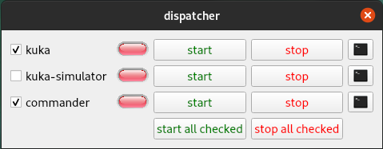
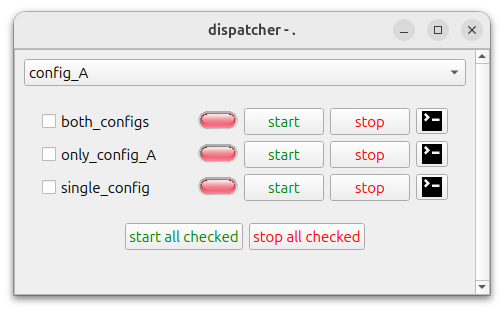
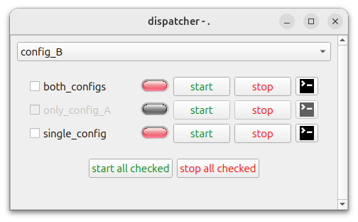
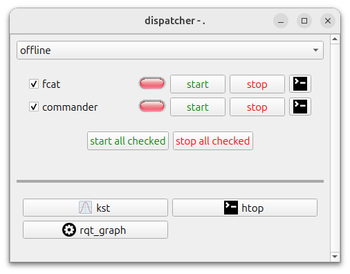
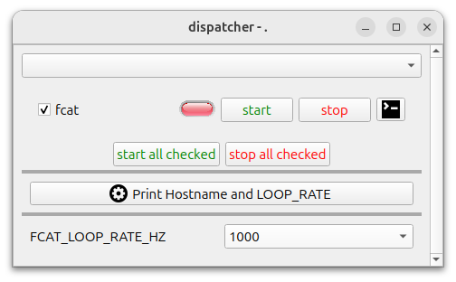
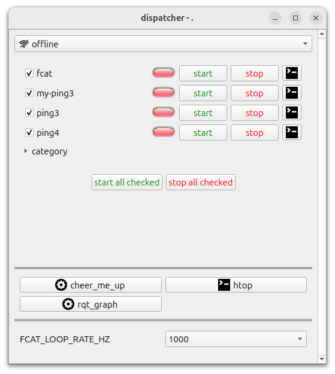
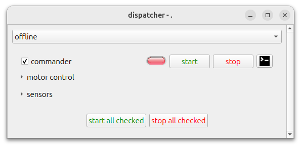
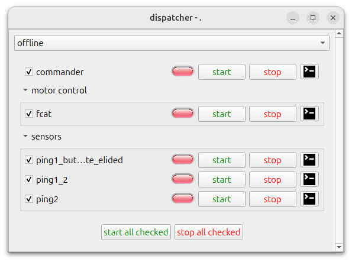
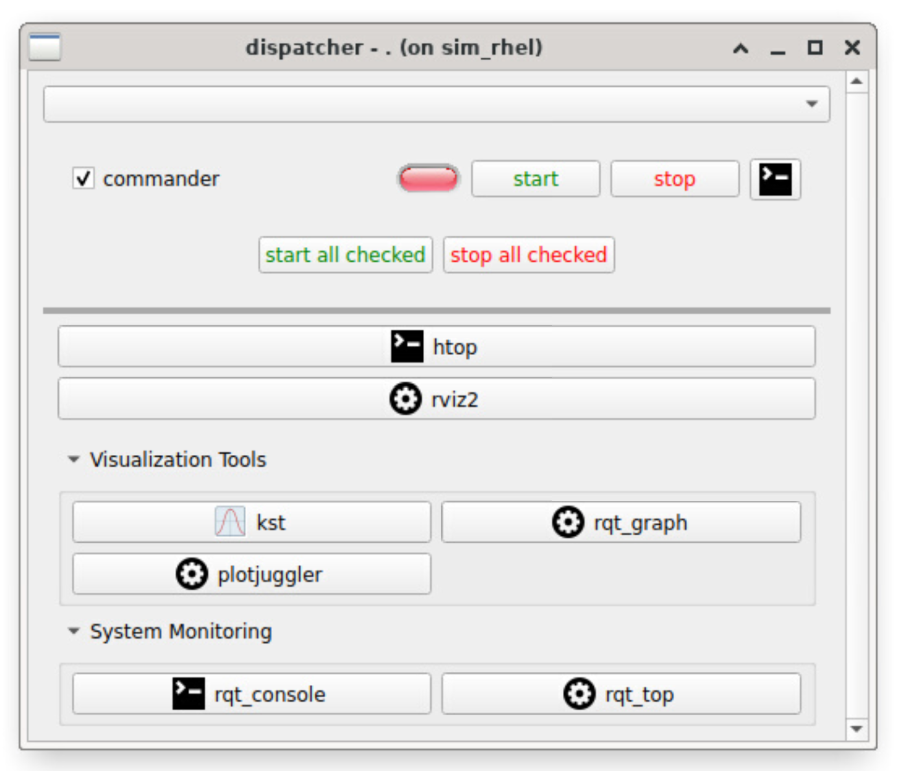

# Dispatcher

A Qt-based ROS 2 widget for starting, stopping, and monitoring both ROS nodes and arbitrary shell processes.



`dispatcher` builds its UI from a YAML file. Each configured item is launched in its own detached tmux session, and the terminal button can attach a `gnome-terminal` window to that session when available.

## Runtime Parameters

The `dispatcher` executable uses the following ROS parameters:

| Name | Type | Default | Description |
| --- | --- | --- | --- |
| `dispatcher_config_path` | `string` | `""` | Path to the dispatcher YAML file. |
| `initial_configuration` | `string` | `""` | Configuration name to select on startup. |
| `ssh_timeout_sec` | `int` | `10` | Timeout used when building remote SSH commands. |
| `target_loop_rate_hz` | `double` | `100.0` | Main process/status polling rate. |

## YAML Configuration

The top-level dispatcher YAML supports:

| Key | Required | Description |
| --- | --- | --- |
| `workspace` | Yes | Workspace path used by ROS process items before sourcing `install/setup.bash`. |
| `nodes` | Yes | Process and category definitions rendered in the main panel. |
| `configurations` | No | Named runtime configurations. Each entry may be a simple name or a map with `name`, `cmd_prefix`, `environment_variables`, and `icon`. |
| `cmd_prefix` | No | Default command prefix for the implicit `all` configuration. |
| `environment_variables` | No | Default environment variables for the implicit `all` configuration. |
| `hide_unconfigured_processes` | No | If true, items missing in the active configuration are hidden instead of disabled. |
| `scripts` | No | Script button definitions shown in the scripts panel. |
| `variables` | No | Variable selectors used for `$VARIABLE` command substitution. |

### Node Types

Each entry in `nodes` can be:

- A ROS process item. If `type` is omitted, the item is treated as ROS by default.
- A shell process item with `type: shell`.
- A collapsible category with `type: category` and an `items` array.

Common item fields include:

| Key | Description |
| --- | --- |
| `name` | UI label and tmux-session base name. |
| `cmd` | Command used for the implicit `all` configuration. |
| `configurations` | Per-configuration command definitions. |
| `start_checked` | Whether the item starts checked in the UI. Optional, defaults to `false`. |
| `stop_tmux_cmd` | Stop sequence sent to tmux. Optional, defaults to `C-C`. |
| `hostname` / `user` | Optional remote execution target for local commands or configuration entries. |
| `use_cmd_prefix` | Enables or disables command-prefix injection. |
| `use_environment_variables` | Enables or disables environment-variable injection. |
| `attach_on_start` | Opens a terminal automatically after launch. |

ROS process items can additionally define `node_name` plus an optional
`namespace` that defaults to an empty string, or a `ros_nodes` array with the same
monitoring fields for online-state monitoring.

Shell process items use `pgrep` on the item name to infer online state.

### Scripts and Variables

Script entries support:

| Key | Description |
| --- | --- |
| `name` | Button label. |
| `cmd` or `configurations` | Script command definition. |
| `row`, `column` | Grid placement in the scripts panel. |
| `icon` | Optional Qt resource path for the button icon. |
| `use_terminal` | Whether to wrap execution in `gnome-terminal --`. |

Variable entries support:

| Key | Description |
| --- | --- |
| `name` | Variable name used in commands, for example `$FCAT_LOOP_RATE_HZ`. |
| `choices` | Selectable values exposed in the UI. |

## Examples

The following examples build incrementally from a minimal configuration to a
full-featured setup. Each one corresponds to a YAML file in [`config/`](config/)
and a screenshot in [`doc/`](doc/).

### Configurations

[`config/example_configurations.yaml`](config/example_configurations.yaml)
shows the simplest multi-configuration setup. Two named configurations
(`config_A` and `config_B`) control which processes are available and which
commands they run. Processes that lack a definition for the active configuration
are grayed out.

| config_A | config_B |
| --- | --- |
|  |  |

```yaml
configurations:
  - config_A
  - config_B

nodes:
  - name: both_configs
    configurations:
      - name: config_A
        cmd: echo "Running config_A"
      - name: config_B
        cmd: echo "Running config_B"
  - name: only_config_A
    configurations:
      - name: config_A
        cmd: echo "Only running config_A"
  - name: single_config
    cmd: echo "Running single_config"
```

### Scripts

[`config/example_scripts.yaml`](config/example_scripts.yaml) adds a **scripts
panel** with one-click action buttons placed in a grid. Each button can
optionally display an icon and choose whether to open in a terminal.



```yaml
scripts:
  - name: kst
    cmd: kst2 &
    icon: :/icons/plot.png
    row: 0
    column: 0
    use_terminal: false

  - name: htop
    cmd: htop
    icon: :/icons/terminal.png
    row: 0
    column: 1
    use_terminal: true

  - name: rqt_graph
    cmd: ros2 run rqt_graph rqt_graph &
    row: 1
    column: 0
    use_terminal: false
```

### Variables

[`config/example_variables.yaml`](config/example_variables.yaml) introduces
**variable selectors** shown as drop-downs in the UI. References like
`$FCAT_LOOP_RATE_HZ` in any command are substituted with the selected value
at launch time.



```yaml
variables:
  - name: FCAT_LOOP_RATE_HZ
    choices:
    - 1000
    - 500
    - 250
    - 100

nodes:
  - name: fcat
    ros_nodes:
    - name: /fcat/fcat
    cmd: ros2 launch robot_bringup fcat_offline.py --rate $FCAT_LOOP_RATE_HZ
    start_checked: true

scripts:
  - name: "Print Hostname and LOOP_RATE"
    cmd: cat /etc/hostname && echo Loop rate $FCAT_LOOP_RATE_HZ
    row: 0
    column: 0
    use_terminal: false
```

### Shell Processes

[`config/example_shell.yaml`](config/example_shell.yaml) combines several
features: `type: shell` processes that use `pgrep` for status,
`hide_unconfigured_processes: true` to hide (rather than gray out) items
without a command for the active configuration, and configuration entries with
custom icons.



```yaml
hide_unconfigured_processes: true

configurations:
  - name: online
    icon: :/icons/wifi.png
  - name: offline
    icon: :/icons/wifi-no.png

nodes:
  - name: fcat
    ros_nodes:
    - namespace: /fcat
      name: fcat
    configurations:
    - name: online
      cmd: ros2 launch ... --rate $FCAT_LOOP_RATE_HZ
    - name: offline
      cmd: ros2 launch ... --rate $FCAT_LOOP_RATE_HZ
    start_checked: true

  - name: my-ping3
    type: shell
    configurations:
    - name: online
      cmd: ping asimov-dev
    - name: offline
      cmd: ping asimov-dev
    start_checked: true
```

### Categories

[`config/example_category.yaml`](config/example_category.yaml) groups
processes into collapsible categories using `type: category`. Each category
can hold any mix of ROS and shell items and can be expanded or collapsed in
the UI.

| collapsed | expanded |
| --- | --- |
|  |  |

```yaml
nodes:
  - name: commander
    namespace: /commander
    node_name: commander
    cmd: ros2 run commander commander
    start_checked: true

  - name: motor control
    type: category
    items:
    - name: fcat
      type: ros
      ros_nodes:
      - namespace: /fcat
        name: fcat
      configurations:
      - name: online
        cmd: ros2 launch ... fcat_online.py
      - name: offline
        cmd: ros2 launch ... fcat_offline.py
      start_checked: true

  - name: sensors
    type: category
    items:
    - name: ping1_but_this_is_a_very_long_name_to_demonstrate_elided
      type: shell
      configurations:
      - name: online
        cmd: ping google.com
      - name: offline
        cmd: ping asimov-dev
      start_checked: true
```

Categories can similarly be used to group the buttons generated with the `scripts` key. This allows the used to cluster buttons, and to toggle their visibility by collapsing them. As with nodes, the syntax is to use `type: category` in the script item YAML definition.



```yaml
workspace: .

nodes:
  - name: commander
    namespace: /commander
    node_name: commander
    cmd: ros2 run commander commander
    start_checked: true

scripts:

  # Regular uncategorized scripts
  - name: htop
    cmd: htop
    icon: :/icons/terminal.png
    row: 0
    column: 0
    use_terminal: true

  # Categorized visualization tools
  - name: Visualization Tools
    type: category
    items:
    - name: kst
      cmd: kst2 &
      icon: :/icons/plot.png
      row: 0
      column: 0
      use_terminal: false

    - name: rqt_graph
      cmd: ros2 run rqt_graph rqt_graph &
      row: 0
      column: 1
      use_terminal: false

    - name: plotjuggler
      cmd: ros2 run plotjuggler plotjuggler &
      row: 1  
      column: 0
      use_terminal: false

  # Categorized monitoring tools
  - name: System Monitoring
    type: category
    items:
    - name: rqt_console
      cmd: ros2 run rqt_console rqt_console &
      icon: :/icons/terminal.png
      row: 0
      column: 0
      use_terminal: false

    - name: rqt_top
      cmd: ros2 run rqt_top rqt_top &
      row: 0
      column: 1
      use_terminal: false

  # Another regular script after categories
  - name: rviz2
    cmd: ros2 run rviz2 rviz2 &
    row: 1
    column: 0
    use_terminal: false
```

### Remote Sessions

[`config/example_remote_session.yaml`](config/example_remote_session.yaml)
demonstrates running commands on a remote host over SSH. Adding `hostname`
(and optionally `user`) to a process or script causes the dispatcher to wrap
the command in `ssh hostname "command"`. Per-configuration environment
variables are also shown.

```yaml
configurations:
  - name: online
    environment_variables:
      RMW_IMPLEMENTATION: rmw_cyclonedds_cpp
      CYCLONEDDS_URI: /etc/cyclonedds_online.xml
  - name: offline
    environment_variables:
      RMW_IMPLEMENTATION: rmw_cyclonedds_cpp
      CYCLONEDDS_URI: /etc/cyclonedds_offline.xml

nodes:
  - name: fcat
    configurations:
    - name: online
      cmd: ros2 launch ... fcat_online.py
      hostname: asimov-dev.jpl.nasa.gov
    - name: offline
      cmd: ros2 launch ... fcat_offline.py
    start_checked: true
```

## Running

From this package directory after building:

```bash
source /opt/ros/jazzy/setup.bash
source install/setup.bash
ros2 run dispatcher dispatcher --ros-args \
  -p dispatcher_config_path:=/path/to/dispatcher/config.yaml \
  -p initial_configuration:=offline
```

If `initial_configuration` is omitted, the first configured entry is used.

The terminal button opens a command like:

```bash
gnome-terminal -t commander -- tmux a -t 3_commander
```

You can attach manually from any terminal. First, you can list them with

```bash
tmux ls
```
For example, for `example_category.yaml` config:
```bash
$ tmux ls
1_commander: 1 windows (created Tue Mar 31 13:00:05 2026)
1_fcat: 1 windows (created Tue Mar 31 13:00:05 2026)
1_ping1_but_this_is_a_very_long_name_to_demonstrate_elided: 1 windows (created Tue Mar 31 13:00:05 2026)
2_ping1_2: 1 windows (created Tue Mar 31 13:00:05 2026)
3_ping2: 1 windows (created Tue Mar 31 13:00:05 2026)
```

Then, attach to the desired session with:

```bash
tmux a -t 1_fcat
```

## Build And Test

Install the dependencies using rosdep:

```bash
rosdep install --from-paths src --ignore-src -r -y
```

Build `dispatcher`. From this package directory, run:

```bash
source /opt/ros/jazzy/setup.bash
colcon build --base-paths . --packages-select dispatcher \
  --cmake-args -DCMAKE_BUILD_TYPE=RelWithDebInfo -DBUILD_TESTING=ON
```

Run the gtest suite with:

```bash
source /opt/ros/jazzy/setup.bash
colcon test --base-paths . --packages-select dispatcher
```

To print the collected test results:

```bash
colcon test-result --verbose
```

## License

This project is licensed under the Apache License, Version 2.0. See the [LICENSE](LICENSE) file for details.