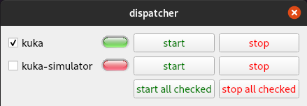

# Dispatcher

A dynamically reconfigurable widget for starting, stopping and monitoring both ROS2 nodes and arbitrary non-ROS processes (aka shell processes).



This package provides a Qt Widget with buttons dynamically configured from a yaml input file. Nodes and processes are launched in detached tmux sessions, which can be attached to from any terminal, or from multiple terminals. The names of those tmux sessions are programmatically named, and in the above example screenshot, those names would be `1_kuka`, `2_kuka-simulator`, and `3_commander`.****

The yaml config file contains the workspace location and settings for a number of ros2 nodes

## Interfaces
| Type              | Interface Name              | Description                                                        |
| ----------------- | --------------------------- | ------------------------------------------------------------------ |
| GetVersionCmd.srv | `commander/srv/get_version` | Used to obtain semantic version information embedded in executable |


## Parameters
| Name                    | Type   | Description                                        | Default |
| ----------------------- | ------ | -------------------------------------------------- | ------- |
| `casah_logs_dir`        | string | Location of log files                              | "/logs" |
| `casah_verbosity_level` | string | One of {`TRACE`, `DEBUG`, `INFO`, `WARN`, `ERROR`} | "INFO"  |
| `target_loop_rate_hz`   | double | Process loop rate                                  | 100     |
| `dispacher_config_path` | string | Path to dispatcher configuration yaml              | ''      |
| `ssh_timeout_sec`       | int    | Timeout in secs when connecting to SSH server      | 10      |


## Example configuration
The following `example.yaml` config illustrates how to set up the dispatcher tool.

```yaml
workspace: /opt/testbed_ws

nodes:

  - name: kuka       # name used for the button and for the tmux session, each one must be unique
    namespace: /kuka  # namespace of ros2 node to monitor
    node_name: kuka # name of ros2 node to monitor
    cmd: ros2 run kuka kuka --ros-args -p kuka_rsi_config_path:=storm_launch/cfg/kuka/kuka_offline.yaml 
    # command to launch node, you can also use ros2 launch to bring up launch files or call the executable directly
    start_checked: true

  ## More entries

  - name: commander
    # type: ros # optional yaml parameter to denote whether entry is a ROS node or arbitrary shell process( i.e type: shell )
    namespace: /commander
    node_name: commander
    cmd: ros2 run commander commander
    start_checked: true
    stop_tmux_keys: "C-D" # Issues a Ctrl+D to close the Python interpreter
```

Start `dispatcher` in your workspace by running:
```bash
cd /opt/testbed_ws
source install/setup.bash
ros2 run dispatcher dispatcher --ros-args -p dispatcher_config_path:=/path/to/example.yaml
```

Click on the start button to begin the node, or click "start all checked" to start all currently
checked nodes.  A green light should appear next to each node. To attach to the commander session, you can run the following in a terminal:

To attach to a running tmux session, you can click the terminal icon to the right of the stop button. This button launches a new gnome-terminal session and attaches to a tmux session using the command:

```bash
gnome-terminal -t commander -- tmux a -t 3_commander 
```

Starting a terminal using the GUI button requires that you have `gnome-terminal` installed. If you do not have `gnome-terminal`, you can attach to the session from the terminal of your choice by running `tmux a -t 3_commander`.

## Other Features

`dispatcher` also supports capabilities such as variables and configurations. Example YAMLs leveraging these capabilities are in the `config/` subdirectory. Briefly, 
- variables are string/numerical values that are substituted in the `cmd:` defined for a ROS node or process
- configurations is the way to run the same node or process in different ways, such as providing different run-time parameters or configuration files.
